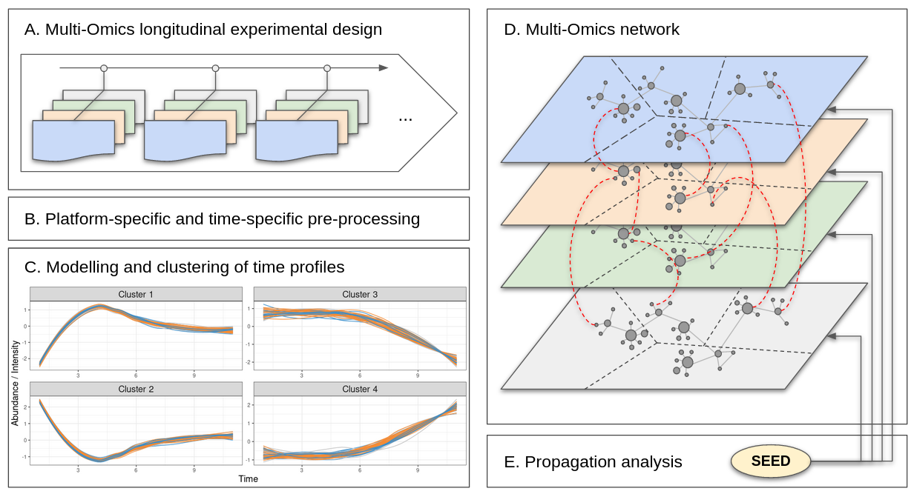

```{r, echo=FALSE}
knitr::opts_chunk$set(fig.align = "center")
```


The emergence of multi-omics data enabled the development of 
integration methods.

With netOmics, we go beyond integration by introducing an interpretation tool.
netOmics is a package for the creation and exploration of multi-omics networks.

Depending on the provided dataset, it allows to create inference networks from 
expression data but also interaction networks from knowledge databases.
After merging the sub-networks to obtain a global multi-omics network, 
we propose network exploration methods using propoagation techniques to perform 
functional prediction or identification of molecular mechanisms.

Furthermore, the package has been developed for longitudinal multi-omics data 
and can be used in conjunction with our previously published package timeOmics.



For more informnation about the method, please check [@bodein2020interpretation]

In this vignette, we introduced a case study which depict the main steps to 
create and explore multi-omics networks from multi-omics time-course data.

# Requirements

```{r,eval=FALSE}
# install the package via BioConductor
if (!requireNamespace("BiocManager", quietly = TRUE))
    install.packages("BiocManager")

BiocManager::install("netOmics")
```

```{r,eval=FALSE}
# install the package via github
library(devtools)
install_github("abodein/netOmics")
```


```{r, eval=TRUE, message=FALSE}
# load the package
library(netOmics)
```


```{r, eval=TRUE, message=FALSE}
# usefull packages to build this vignette
library(timeOmics)
library(tidyverse)
library(igraph)
```

# Case Study: Human Microbiome Project T2D

The package will be illustrated on longitudinal MO dataset to study 
the seasonality of MO expression in patients with diabetes [@sailani2020deep].

The data used in this vignette is a subset of the data available at: 
https://github.com/aametwally/ipop_seasonal

We focused on a single individual with 7 timepoints.
6 different omics were sampled 
(RNA, proteins, cytokines, gut microbiome, metabolites and clinical variables).

```{r load_data}
# load data
data("hmp_T2D")
```


# (optional: *timeOmics* analysis)

The first step of the analysis is the preprocessing and longitudinal clustering.
This step is carried out with timeOmics and should be reserved for longitudinal 
data.

It ensures that the time profiles are classified into groups of similar profiles
so each MO molecule is labbeled with its cluster.

In addition, timeOmics can identify a multi-omics signature of the clusters.
These molecules can be, for example, the starting points of the propogation 
analysis.

For more informations about *timeOmics*, please 
check http://www.bioconductor.org/packages/release/bioc/html/timeOmics.html

As illustrated in the R chunk below the timeOmics step includes:

* omic-specific preprocessing and longitudinal fold-change filtering
* modelling of expression profiles
* clustering of MO expression profiles
* signature identification by cluster

```{r timeOmics_1, eval=FALSE}
# not evaluated in this vignette

#1 filter fold-change
remove.low.cv <- function(X, cutoff = 0.5){
    # var.coef
    cv <- unlist(lapply(as.data.frame(X), 
                    function(x) abs(sd(x, na.rm = TRUE)/mean(x, na.rm= TRUE))))
    return(X[,cv > cutoff])
}
fc.threshold <- list("RNA"= 1.5, "CLINICAL"=0.2, "GUT"=1.5, "METAB"=1.5,
                     "PROT" = 1.5, "CYTO" = 1)

# --> hmp_T2D$raw
data.filter <- imap(raw, ~{remove.low.cv(.x, cutoff = fc.threshold[[.y]])})

#2 scale
data <- lapply(data.filter, function(x) log(x+1))
# --> hmp_T2D$data


#3 modelling
lmms.func <- function(X){
    time <- rownames(X) %>% str_split("_") %>% 
      map_chr(~.x[[2]]) %>% as.numeric()
    lmms.output <- lmms::lmmSpline(data = X, time = time,
                                   sampleID = rownames(X), deri = FALSE,
                                   basis = "p-spline", numCores = 4, 
                                   keepModels = TRUE)
    return(lmms.output)
}
data.modelled <- lapply(data, function(x) lmms.func(x))

# 4 clustering
block.res <- block.pls(data.modelled, indY = 1, ncomp = 1)
getCluster.res <- getCluster(block.res)
# --> hmp_T2D$getCluster.res


# 5 signature
list.keepX <- list("CLINICAL" = 4, "CYTO" = 3, "GUT" = 10, "METAB" = 3, 
                   "PROT" = 2,"RNA" = 34)
sparse.block.res  <- block.spls(data.modelled, indY = 1, ncomp = 1, scale =TRUE, 
                                keepX =list.keepX)
getCluster.sparse.res <- getCluster(sparse.block.res)
# --> hmp_T2D$getCluster.sparse.res
```

timeOmics resulted in 2 clusters, labelled `1` and `-1`

```{r timeOmics_2}
# clustering results
cluster.info <- hmp_T2D$getCluster.res
```

# Network building

Each layer of the network is built sequentially and then assembled 
in a second section.

All the functions in the package can be used on one element or a list of 
elements.
In the longitudinal context of the data, kinetic cluster sub-networks are built 
plus a global network
(`1`, `-1` and `All`).

## Inference Network

Multi-omics network building starts with a first layer of gene.
Currently, the ARACNe algorithm handles the inference but we will include more 
algorithms in the future.

The function `get_grn` return a Gene Regulatory Network from gene expression 
data. 
Optionally, the user can provide a timeOmics clustering result (`?getCluster`) 
to get cluster specific sub-networks. In this case study, this will 
automatically build the networks (`1`, `-1` and `All`), as indicated previously.

The `get_graph_stats` function provides basic graph statistics such as the 
number of vertices and edges.
If the vertices have different attributes, it also includes a summary of these.

```{r graph.rna, warning=FALSE}
cluster.info.RNA <- timeOmics::getCluster(cluster.info, user.block = "RNA")
graph.rna <- get_grn(X = hmp_T2D$data$RNA, cluster = cluster.info.RNA)

# to get info about the network
get_graph_stats(graph.rna)
```

## Interaction from databases

As for the genes, the second layer is a protein layer (Protein-Protein 
Interaction).
This time, no inference is performed. Instead, known interactions are extracted
from a database of interaction (BIOGRID).

The function `get_interaction_from_database` will fetch the interactions from a 
database provided as a `data.frame` (with columns `from` and `to`) or a graph 
(`igraph` object).
In addition to the interactions between the indicated molecules, the first 
degree neighbors can also be collected (option `user.ego = TRUE`)


```{r PROT_graph, warning=FALSE}
# Utility function to get the molecules by cluster
get_list_mol_cluster <- function(cluster.info, user.block){
  require(timeOmics)
    tmp <- timeOmics::getCluster(cluster.info, user.block) 
    res <- tmp %>% split(.$cluster) %>% 
        lapply(function(x) x$molecule)
    res[["All"]] <- tmp$molecule
    return(res)
}

cluster.info.prot <- get_list_mol_cluster(cluster.info, user.block = 'PROT')
graph.prot <-  get_interaction_from_database(X = cluster.info.prot, 
                                             db = hmp_T2D$interaction.biogrid, 
                                             type = "PROT", user.ego = TRUE)
# get_graph_stats(graph.prot)
```

In this example, only a subset of the Biogrid database is used 
(matching elements).

## Other inference methods

Another way to compute networks from expression data is to use other inference
methods.
In the following chunk, we intend to illustrate the use of the SparCC algorithm
[@friedman2012inferring] on the gut data and how it can be integrate into the 
pipeline. 
(sparcc is not included in this package)


```{r GUT_graph, eval = FALSE}
# not evaluated in this vignette
library(SpiecEasi)

get_sparcc_graph <- function(X, threshold = 0.3){
    res.sparcc <- sparcc(data = X)
    sparcc.graph <- abs(res.sparcc$Cor) >= threshold
    colnames(sparcc.graph) <-  colnames(X)
    rownames(sparcc.graph) <-  colnames(X)
    res.graph <- graph_from_adjacency_matrix(sparcc.graph, 
                                             mode = "undirected") %>% simplify
    return(res.graph)
}

gut_list <- get_list_mol_cluster(cluster.info, user.block = 'GUT')

graph.gut <- list()
graph.gut[["All"]] <- get_sparcc_graph(hmp_T2D$raw$GUT, threshold = 0.3)
graph.gut[["1"]] <- get_sparcc_graph(hmp_T2D$raw$GUT %>% 
                                       dplyr::select(gut_list[["1"]]), 
                                     threshold = 0.3)
graph.gut[["-1"]] <- get_sparcc_graph(hmp_T2D$raw$GUT %>% 
                                        dplyr::select(gut_list[["-1"]]), 
                                      threshold = 0.3)
class(graph.gut) <- "list.igraph"
```

```{r GUT}
graph.gut <- hmp_T2D$graph.gut
# get_graph_stats(graph.gut)
```

## Other examples

For this case study, we complete this first step of network building with the 
missing layers.

```{r CYTO_graph, warning=FALSE}
# CYTO -> from database (biogrid)
cyto_list = get_list_mol_cluster(cluster.info = cluster.info, 
                                 user.block = "CYTO")
graph.cyto <-  get_interaction_from_database(X = cyto_list,
                                             db = hmp_T2D$interaction.biogrid, 
                                             type = "CYTO", user.ego = TRUE)
# get_graph_stats(graph.cyto)

# METAB -> inference
cluster.info.metab <-  timeOmics::getCluster(X = cluster.info, 
                                             user.block = "METAB")
graph.metab <-  get_grn(X = hmp_T2D$data$METAB, 
                        cluster = cluster.info.metab)
# get_graph_stats(graph.metab)

# CLINICAL -> inference
cluster.info.clinical <- timeOmics::getCluster(X = cluster.info, 
                                               user.block = 'CLINICAL')
graph.clinical <- get_grn(X = hmp_T2D$data$CLINICAL,
                          cluster = cluster.info.clinical)
# get_graph_stats(graph.clinical)
```

# Layer merging

We included 2 types of layer merging: 

* *merging with interactions* uses the shared elements between 2 graphs to build
a larger network.
* *merging with correlations* uses the spearman correlation from expression 
profiles between 2 layers when any interaction is known.


## Merging with interactions

The function `combine_layers` enables the fusion of different network layers.
It combines the network (or list of network) in `graph1` with the network
(or list of network) in `graph2`, based on the shared vertices between
the networks.

Additionally, the user can provide an interaction table `interaction.df`
(in the form of a data.frame or igraph object).

In the following chunk, we sequentially merge RNA, PROT and CYTO layers and uses
the TFome information (TF protein -> Target Gene) to connect these layers.

```{r, merged_0}
full.graph <- combine_layers(graph1 = graph.rna, graph2 = graph.prot)
full.graph <- combine_layers(graph1 = full.graph, graph2 = graph.cyto)

full.graph <- combine_layers(graph1 = full.graph,
                             graph2 = hmp_T2D$interaction.TF)
# get_graph_stats(full.graph)
```

## Merging with correlations

To connect omics layers for which no interaction information is available,
we propose to use a threshold on the correlation between the expression profiles
of two or more omics data.

The strategy is as follows: we isolate the omics from the data and calculate
the correlations between this omics and the other data.

```{r merged_1_gut, warning=FALSE}
all_data <- reduce(hmp_T2D$data, cbind)

# omic = gut
gut_list <- get_list_mol_cluster(cluster.info, user.block = "GUT")
omic_data <- lapply(gut_list, function(x)dplyr::select(hmp_T2D$data$GUT, x))

# other data = "RNA", "PROT", "CYTO"
other_data_list <- get_list_mol_cluster(cluster.info,
                                        user.block = c("RNA", "PROT", "CYTO"))
other_data <- lapply(other_data_list, function(x)dplyr::select(all_data, x))

# get interaction between gut data and other data
interaction_df_gut <- get_interaction_from_correlation(X = omic_data,
                                                       Y = other_data,
                                                       threshold = 0.99)

# and merge with full graph
full.graph <- combine_layers(graph1 = full.graph,
                             graph2 = hmp_T2D$graph.gut,
                             interaction.df = interaction_df_gut$All)
```


```{r, merged_2_clinical, warning=FALSE}
# omic =  Clinical
clinical_list <- get_list_mol_cluster(cluster.info, user.block = "CLINICAL")
omic_data <- lapply(clinical_list, 
                    function(x)dplyr::select(hmp_T2D$data$CLINICAL, x))

# other data = "RNA", "PROT", "CYTO", "GUT"
other_data_list <- get_list_mol_cluster(cluster.info,
                                        user.block = c("RNA", "PROT", 
                                                       "CYTO", "GUT"))
other_data <- lapply(other_data_list, function(x)dplyr::select(all_data, x))


# get interaction between gut data and other data
interaction_df_clinical <- get_interaction_from_correlation(X = omic_data
                                                            , Y = other_data,
                                                            threshold = 0.99)

# and merge with full graph
full.graph <- combine_layers(graph1 = full.graph,
                             graph2 = hmp_T2D$graph.clinical, 
                             interaction.df = interaction_df_clinical$All)
```


```{r, merged_3_metab, warning=FALSE}
# omic =  Metab
metab_list <- get_list_mol_cluster(cluster.info, user.block = "METAB")
omic_data <- lapply(metab_list, function(x)dplyr::select(hmp_T2D$data$METAB, x))

# other data = "RNA", "PROT", "CYTO", "GUT", "CLINICAL"
other_data_list <- get_list_mol_cluster(cluster.info,
                                        user.block = c("RNA", "PROT", "CYTO", 
                                                       "GUT", "CLINICAL"))
other_data <- lapply(other_data_list, function(x)dplyr::select(all_data, x))

# get interaction between gut data and other data
interaction_df_metab <- get_interaction_from_correlation(X = omic_data,
                                                         Y = other_data, 
                                                         threshold = 0.99)

# and merge with full graph
full.graph <- combine_layers(graph1 = full.graph, 
                             graph2 = graph.metab, 
                             interaction.df = interaction_df_metab$All)
```

# Addition of supplemental layers

For the interpretation of the MO integration results, the use of additional 
information layers or molecules can be useful to enrich the network.

## Over Representation Analysis

ORA is a common step to include knowledge.
The function `get_interaction_from_ORA` perform the ORA analysis from the 
desired molecules and return an interaction graph with the enriched terms and 
the corresponding molecules.

Then, the interaction graph with the new vertices can be linked to the network 
as illustrated in the previous step.

Here, ORA was performed with RNA, PROT, and CYTO against the Gene Ontology.

```{r}
# ORA by cluster/All
mol_ora <- get_list_mol_cluster(cluster.info, 
                                user.block = c("RNA", "PROT", "CYTO"))

# get ORA interaction graph by cluster
graph.go <- get_interaction_from_ORA(query = mol_ora,
                                     sources = "GO",
                                     organism = "hsapiens",
                                     signif.value = TRUE)

# merge
full.graph <- combine_layers(graph1 = full.graph, graph2 = graph.go)
```

## External knowledge

Additionally, knowledge from external sources can be included in the network.

In the following chunk, we performed disease-related gene enrichment analysis
from *medlineRanker* (http://cbdm-01.zdv.uni-mainz.de/~jfontain/cms/?page_id=4).
We converted the results into a data.frame (with the columns `from` and `to`)
and this acted as an interaction database.

```{r}
# medlineRanker -> database
medlineranker.res.df <- hmp_T2D$medlineranker.res.df %>% 
  dplyr::select(Disease, symbol) %>% 
  set_names(c("from", "to"))
  
mol_list <-  get_list_mol_cluster(cluster.info = cluster.info,
                                  user.block = c("RNA", "PROT", "CYTO"))
graph.medlineranker <-  get_interaction_from_database(X = mol_list,
                                                      db = medlineranker.res.df, 
                                                      type = "Disease",
                                                      user.ego = TRUE)
# get_graph_stats(graph.medlineranker)

# merging
full.graph <- combine_layers(graph1 = full.graph, graph2 = graph.medlineranker)
```

We complete the MO network preparation with attribute cleaning and addition of 
several attributes such as:

* mode = "core" if the vertex was originally present in the data; "extended"
otherwise
* sparse = TRUE if the vertex was present in kinetic cluster signature; FALSE
otherwise
* type = type of omics ("RNA","PROT","CLINICAL","CYTO","GUT","METAB","GO",
"Disease")
* cluster = '1', '-1' or 'NA' (for vertices not originally present in the
original data)

```{r}
# graph cleaning
graph_cleaning <- function(X, cluster.info){
    # no reusability
    X <- igraph::simplify(X)
    va <- vertex_attr(X)
    viewed_mol <- c()
    for(omic in unique(cluster.info$block)){
        mol <- intersect(cluster.info %>% dplyr::filter(.$block == omic) %>%
                           pull(molecule), V(X)$name)
        viewed_mol <- c(viewed_mol, mol)
        X <- set_vertex_attr(graph = X, 
                             name = "type", 
                             index = mol, 
                             value = omic)
        X <- set_vertex_attr(graph = X, 
                             name = "mode",
                             index = mol,
                             value = "core")
    }
    # add medline ranker and go
    mol <- intersect(map(graph.go, ~ as_data_frame(.x)$to) %>%
                       unlist %>% unique(), V(X)$name) # only GO terms
    viewed_mol <- c(viewed_mol, mol)
    X <- set_vertex_attr(graph = X, name = "type", index = mol, value = "GO")
    X <- set_vertex_attr(graph = X, name = "mode", 
                         index = mol, value = "extended")
    
    mol <- intersect(as.character(medlineranker.res.df$from), V(X)$name)
    viewed_mol <- c(viewed_mol, mol)
    X <- set_vertex_attr(graph = X, name = "type",
                         index = mol, value = "Disease")
    X <- set_vertex_attr(graph = X, name = "mode",
                         index = mol, value = "extended")
    
    other_mol <- setdiff(V(X), viewed_mol)
    if(!is_empty(other_mol)){
        X <- set_vertex_attr(graph = X, name = "mode",
                             index = other_mol, value = "extended")
    }
    X <- set_vertex_attr(graph = X, name = "mode", 
                         index = intersect(cluster.info$molecule, V(X)$name), 
                         value = "core")
    
    # signature
    mol <-  intersect(V(X)$name, hmp_T2D$getCluster.sparse.res$molecule)
    X <- set_vertex_attr(graph = X, name = "sparse", index = mol, value = TRUE)
    mol <-  setdiff(V(X)$name, hmp_T2D$getCluster.sparse.res$molecule)
    X <- set_vertex_attr(graph = X, name = "sparse", index = mol, value = FALSE)
    
    return(X)
}
```


```{r}
FULL <- lapply(full.graph, function(x) graph_cleaning(x, cluster.info))
get_graph_stats(FULL)
```

# Network exploration

## Basics network exploration

We can use basic graph statistics to explore the network such as degree 
distribution, modularity, and short path.

```{r, eval = FALSE}
# degree analysis
d <- degree(FULL$All)
hist(d)
d[max(d)]

# modularity # Warnings: can take several minutes
res.mod <- walktrap.community(FULL$All)
# ...

# modularity
sp <- shortest.paths(FULL$All)
```

## Random walk with restart

RWR is a powerful tool to explore the MO networks which simulates a particle 
that randomly walk on the network.
From a starting point (`seed`) it ranks the other vertices based on their
proximity with the seed and the network structure.

We use RWR for function prediction and molecular mechanism identification.

In the example below, the seeds were the GO terms vertices.

```{r}
# seeds = all vertices -> takes 5 minutes to run on regular computer
# seeds <- V(FULL$All)$name
# rwr_res <- random_walk_restart(FULL, seeds)

# seed = some GO terms
seeds <- head(V(FULL$All)$name[V(FULL$All)$type == "GO"])
rwr_res <- random_walk_restart(FULL, seeds)
```

### Find vertices with specific attributes

After the RWR analysis, we implemented several functions to extract valuable
information.

To identify MO molecular functions, the seed can be a GO term and we are 
interested to identify vertices with different omics type within the 
closest nodes.

The function `rwr_find_seeds_between_attributes` can identify which seeds were 
able to reach vertices with different attributes (ex: `type`) within the 
closest `k` (ex: `15`) vertices.

The function `summary_plot_rwr_attributes` displays the number of different 
values for a seed attribute as a bar graph.

```{r}
rwr_type_k15 <- rwr_find_seeds_between_attributes(X = rwr_res, 
                                                  attribute = "type", k = 15)

# a summary plot function
summary_plot_rwr_attributes(rwr_type_k15)
summary_plot_rwr_attributes(rwr_type_k15$All)
```

Alternatively, we can be interested to find functions or molecules which 
link different kinetic cluster (to find regulatory mechanisms).

```{r}
rwr_type_k15 <- rwr_find_seeds_between_attributes(X = rwr_res$All, 
                                                  attribute = "cluster", k = 15)
summary_plot_rwr_attributes(rwr_type_k15)
```

A RWR subnetworks can also be displayed with `plot_rwr_subnetwork` 
from a specific seed.
```{r}
sub_res <- rwr_type_k15$`GO:0005737`
sub <- plot_rwr_subnetwork(sub_res, legend = TRUE, plot = TRUE)
```

### Function prediction

Finally, RWR can also be used for function prediction.
From an annotated genes, the predicted function can be the closest vertex of the
type "GO".

We generalized this principle to identify, from a seed of interest, the closest
node (or `top` closest nodes) with specific attributes and value.

In the example below, the gene "ZNF263" is linked to the 5 closest nodes of 
type = 'GO' and type = 'Disease'.

```{r}
rwr_res <- random_walk_restart(FULL$All, seed = "ZNF263")

# closest GO term
rwr_find_closest_type(rwr_res, seed = "ZNF263", attribute = "type", 
                      value = "GO", top = 5)

# closest Disease
rwr_find_closest_type(rwr_res, seed = "ZNF263", attribute = "type", 
                      value = "Disease", top = 5)

# closest nodes with an attribute "cluster" and the value "-1"
rwr_find_closest_type(rwr_res, seed = "ZNF263", attribute = "cluster",
                      value = "-1", top = 5)
```


```{r, eval = FALSE}
seeds <- V(FULL$All)$name[V(FULL$All)$type %in% c("GO", "Disease")]
```

```{r}
sessionInfo()
```

# References